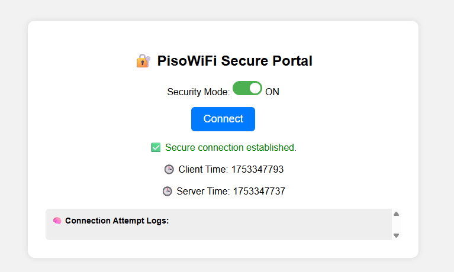
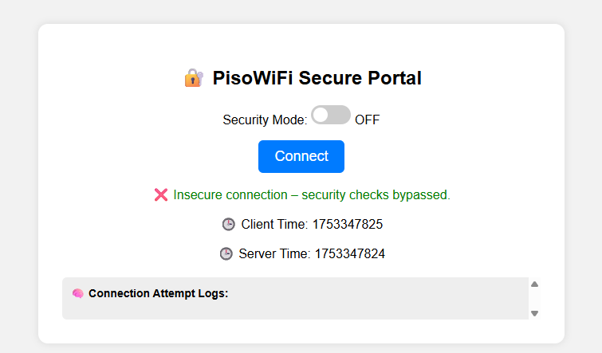
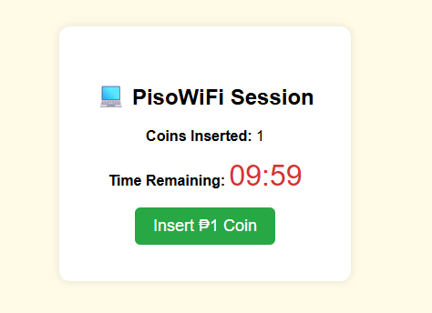

# 🔐 PisoWiFi Secure Connection Simulator

A simple yet powerful simulation of a PisoWiFi system with real-world
security protocols to defend against common network attacks such as
Man-in-the-Middle (MITM), MAC address spoofing, and replay attacks.

## 📌 Features

-   ✅ HMAC authentication using shared secret key
-   🕒 Timestamp validation to prevent replay attacks
-   🧿 MAC address hashing and whitelisting
-   🧨 Simulated MITM and spoofing attacker script
-   🔀 Toggle switch to enable/disable security protocols
-   🧠 Real-time frontend log display for connection attempts
-   ⏳ Post-connection session with coin-to-time system (₱1 = 10
    minutes)

## 📂 Project Structure

    SimplePisoWiFi/
    ├── app.py                      # Flask backend
    ├── simulate_attacker.py       # Attacker script to simulate spoofing/MITM
    ├── secure_utils.py            # Helper methods: HMAC + MAC hashing
    ├── templates/
    │   ├── index.html             # Secure portal frontend
    │   └── session.html           # Post-connection session UI
    ├── static/                    # Optional: JS/CSS if separated
    ├── images/               
│   ├── image1.png
│   ├── image2.png
│   ├── image3.png
    ├── requirements.txt           # Python dependencies
    └── README.md

## 🚀 How to Run

### 1. Clone the Repository

    git clone https://github.com/yourusername/pisowifi-simulator.git
    cd pisowifi-simulator

### 2. Install Requirements

    pip install -r requirements.txt

### 3. Run the Server

    python app.py

Visit <http://127.0.0.1:5000> to test.

### 4. Simulate an Attack

In a new terminal:

    python simulate_attacker.py

See how the backend reacts and logs the attempt in the frontend portal.

## 🛡 Security Design

Implemented protocols:

-   **HMAC**: `HMAC(secret, mac + timestamp)` ensures request
    authenticity
-   **Timestamp**: Freshness check (±30s) prevents replay
-   **MAC Whitelisting**: Blocks spoofed addresses
-   **MITM Simulation**: Malicious script tries to mimic legit client

> You can toggle security off to show how insecure systems behave.

## 📘 Screenshots {#screenshots-1}

Add here your screenshots or gifs of:

-   ✅ Secure connection

> 

-   ❌ Attack rejection
-   
-   ⏳ Timer-based session
-   

## 🔧 To-Do / Improvements

• ![]**🔁 Auto-refresh logs** on the frontend
without full page reload (AJAX or Fetch API)

• ![]**📶 Real-time attack visualizer** (e.g.
blinking red alert or sound effect for detected spoof/MITM)

• ![]**📱 Responsive design** for mobile display on
actual PisoWiFi screens

• ![]**🧪 Unit tests** for key backend logic
(verify_hmac(), timestamp checks, etc.)

• ![]**📊 Analytics page** for admins (view attempt
history, stats by MAC/device)

• ![]**📸 Add screen recordings or GIF demos** in
the README for better showcase

• ![]**🔐 Add CAPTCHA or fingerprinting** to resist
bot abuse

• ![]**📄 Export logs** as downloadable CSV

• ![]**🧾 Add virtual coin payment simulation**
(mock GCash/QR payment?)

• ![]**🛠 Convert to RESTful API version** for
integration with actual PisoWiFi hardware

• ![]*🌐 Dockerize the project** for easy
deployment

• ![]**🧰 Deploy to Replit or Render.com** for live
demo link

## 🧠 Credits

Developed by [Daniel Jon Santos](https://github.com/yourusername) as a
simulation project for secure PisoWiFi systems.
